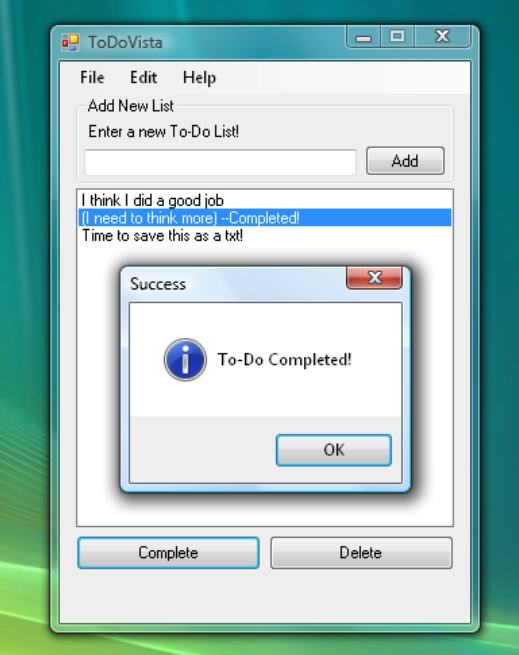

# ToDoVista
ToDoVista is a simple ToDo application made native for Windows Vista. It's perfect for beginner programmers to learn creating Windows Native GUI applications using C# language. It's good for those who would like to feel that nostalgic feeling making small projects in Visual C# 2008-2010 or old OSes. The release version (when available) is perfect for those who still playing around in Windows Vista but need a simple working open-source productivity tool.

 <i>Screenshot v.1.0.0</i>

## Background
So I often use ToDo applications such as Microsoft To-Do, Google Tasks, etc. I decided to install Windows Vista in a VM and use it as my daily OS for a while to remember the first time I had a Windows Vista laptop. But then I realize that I need a ToDo applications to even manage my tasks in the old OS. The first time I learned code was also in a Windows Vista environtment using Visual C# 2008. And while I got nothing to do in weekend, I tried to make this app.

## Features
The main features of this simple app is:
- Add a todo
- Delete a todo 
 
- Mark Todo as complete (Done in 1.1.0) 

- Save ToDo list to a file (Done in 1.1.0) 
 
 
 

## Technical Specification
This application was made using:
- Visual C# 2008 Express
- .NET Framework 3.5

## Installation Instructions
There are no releases (portable or setup-based) yet. To try to use it, simply open the project using Visual C# 2008-2010 (Or Visual Studio with .NET Framework (Native Windows) feature installed) and try to run or build it yourself.

I will consider to make a fully working installer later on (maybe using Inno Setup or default VS installer). Stay tuned!

### Changelogs
- 1.0.0 - Initial project creation
- 1.1.0 - Completion of Mark Todo as Complete and Save Todo List to a file (txt)

## Usage
Feel free to clone, build, or do whatever with this source code for personal and education/learning purposes only.